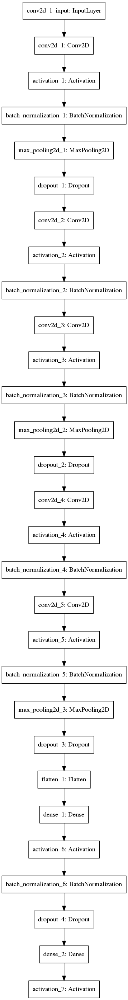
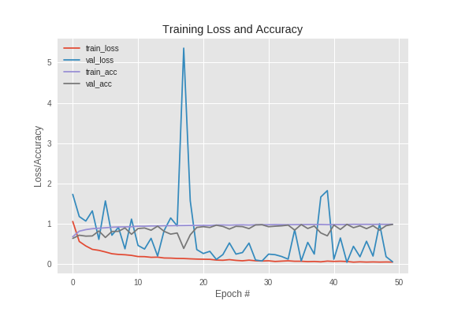

## Plant Disease Detection
A webapp to predict a the type of plant disease for a given sample.
This repository is a simple project to identify different types of plant diseases.
Dataset for the project was downloaded from [here.](https://github.com/spMohanty/PlantVillage-Dataset)

The dataset contains images of plants with different diseases. In total, there were 30+ unique categories.
Some of them are
* Black Rot
* Powdery Mildew
* Late Blight
* Early Blight
* Bacterial spot
* others

#### Classes
* bacterial_spot
* leaf_mold
* septoria_leaf_spot
* yellow_leaf_curl_virus
* early_blight
* mosaic_virus
* spider_mites
* leaf_blight
* powdery_mildew
* target_spot

Classes belonging to same disease but for different plants, were combined together to create more data samples. Example. Peach_Bacterial_Spot, Tomato_Bacterial_Spot & Pepper_Bell_Bacterial_Spot were combined together to form a single class **bacterial_spot.**

#### Count

#### Model
Below is the model architecture

Key points:
* Number of Epochs : 50
* Activation : ReLU & SoftMax
* Optimizer : Adam
* Loss : Categorical CrossEntropy

#### Accuracy Plots

The entire model was done on [Google Colab](https://colab.research.google.com/), were they provide a GPU environment which is preconfigured for Deep Learning purpose.

My Google Colab Notebook for this project can be found [here.](https://drive.google.com/file/d/1yrSBy0bMJdNsih-jh6oCyTALB5ONACIy/view?usp=sharing)

### How to run it
