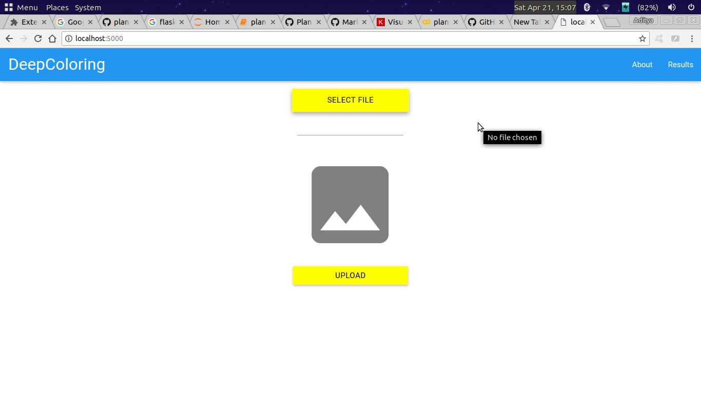
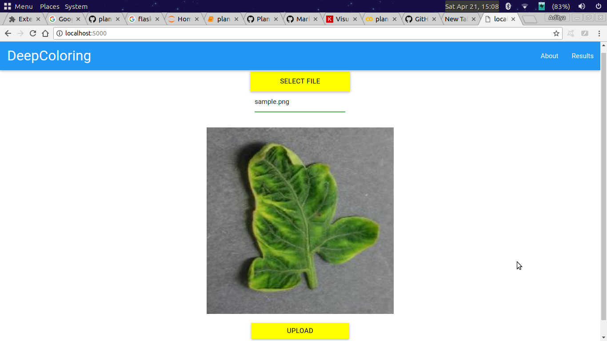
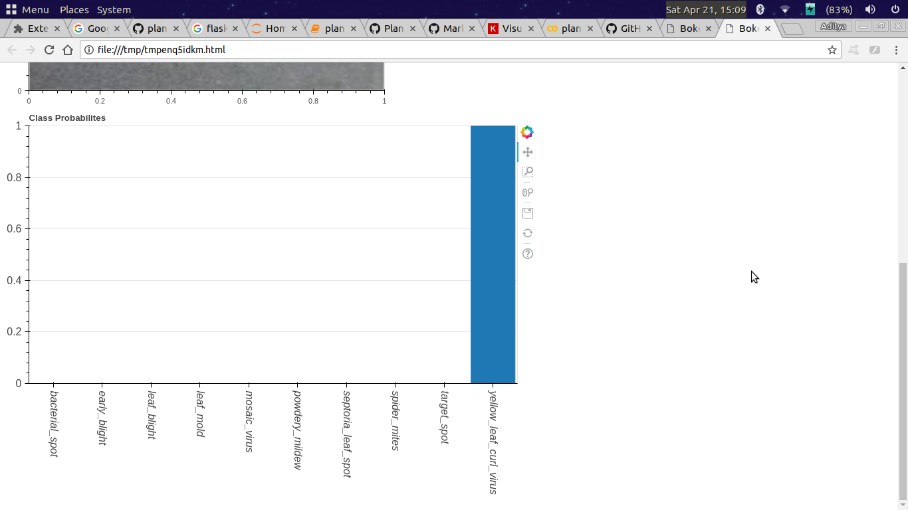

## Plant Disease Detection
A webapp to predict the type of plant disease for a given sample.
This repository is a simple project to identify different types of plant diseases.
Dataset for the project was downloaded from [here.](https://github.com/spMohanty/PlantVillage-Dataset)

The dataset contains images of plants with different diseases. In total, there were 30+ unique categories.
Some of them are
* Black Rot
* Powdery Mildew
* Late Blight
* Early Blight
* Bacterial spot
* others

### Classes
Following is the list of classes which we considered for our task:
* bacterial_spot
* leaf_mold
* septoria_leaf_spot
* yellow_leaf_curl_virus
* early_blight
* mosaic_virus
* spider_mites
* leaf_blight
* powdery_mildew
* target_spot

Classes belonging to same disease but for different plants, were combined together to create more data samples. **Example** Peach_Bacterial_Spot, Tomato_Bacterial_Spot & Pepper_Bell_Bacterial_Spot were combined together to form a single class **bacterial_spot.**

### Count


### Model
Below is the model architecture


Key points:
* Number of Epochs : 50
* Activation : ReLU & SoftMax
* Optimizer : Adam
* Loss : Categorical CrossEntropy

### Accuracy Plots


The entire model was trained on [Google Colab](https://colab.research.google.com/), were they provide a GPU environment which is preconfigured for Deep Learning purpose.

My Google Colab Notebook for this project can be found [here.](https://drive.google.com/file/d/1yrSBy0bMJdNsih-jh6oCyTALB5ONACIy/view?usp=sharing)

### How to run it?

#### Install the following list of packages
* Flask
* Bokeh
* Keras
* OpenCV
* imutils
* Matplotlib

#### Clone the repo
Create a local copy of this repo by cloning it 
```
git clone https://github.com/adimyth/plant_disease.git
```

#### Running the Flask Server
```
cd plant_disease
python main.py
``` 
* In your browser go to **localhost:5000**
* Select a file using the _SELECT FILE_ button
* Click on _UPLOAD_
* The result for the most recent input file can be found in **RESULTS** section

#### Screens




### There are some changes still to be done, which I'll do in future.